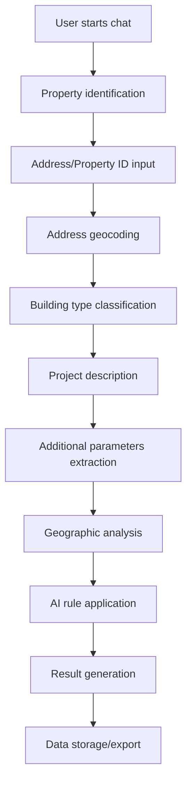
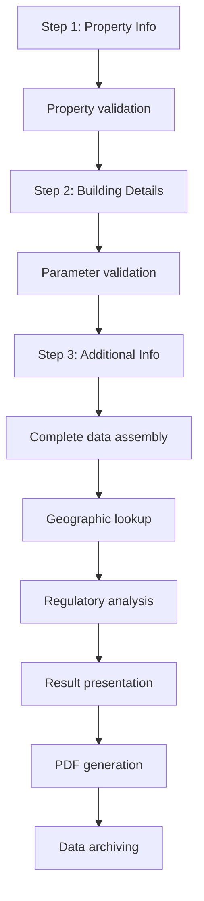

# Data Collection Flow Analysis - Bygglovsagenten

## Data Collection Workflows

### Chat Interface Data Flow



### Form Interface Data Flow



## Data Quality and Validation

### Property Data Validation
```javascript
// Address validation through geocoding
const validateProperty = async (address) => {
  const geocoded = await geocodeAddress(address);
  const coordinates = await transformCoordinates(geocoded);
  const withinMunicipality = await checkMunicipalBounds(coordinates);
  return { valid: withinMunicipality, coordinates };
};
```

### Building Parameter Extraction
```javascript
// Natural language processing for building details
const extractBuildingParams = (userInput) => {
  const areaMatch = userInput.match(/(\\d+)\\s*(?:kvm|m2|kvadratmeter)/i);
  const heightMatch = userInput.match(/(\\d+(?:\\.\\d+)?)\\s*(?:m|meter)\\s*(?:hög|höjd)/i);
  
  return {
    area: areaMatch ? parseFloat(areaMatch[1]) : null,
    height: heightMatch ? parseFloat(heightMatch[1]) : null,
    placement: extractPlacementInfo(userInput)
  };
};
```

## Statistical Data for Urban Planning

### Building Type Distribution Analysis
The application can track and analyze:
- **Attefallshus**: Small residential buildings (≤25 sqm)
- **Tillbyggnad**: Extensions to existing buildings
- **Garage**: Detached garage structures
- **Annat**: Other building types

### Geographic Heat Mapping
Data collected enables:
- **Development density** mapping by neighborhood
- **Building size trends** by area
- **Permit success rates** by location
- **Processing time analysis** by project type

### Temporal Analysis
Time-series data provides insights on:
- **Seasonal building patterns**
- **Economic cycle correlations**
- **Policy impact measurements**
- **Infrastructure planning needs**

## Municipal Decision Support

### Planning Committee Insights
Regular reports can show:
- **Application volume trends**
- **Compliance rate patterns**
- **Geographic development pressure**
- **Resource allocation needs**

### Policy Effectiveness Metrics
The system can measure:
- **Detailed plan utilization rates**
- **Regulation clarity** (low uncertainty rates)
- **Process efficiency** improvements
- **Citizen satisfaction** indicators

## Data Export Formats

### Planning Software Integration
```json
{
  "export_format": "planning_analysis",
  "time_period": "2024-Q1",
  "data": {
    "applications": [
      {
        "id": "uuid",
        "date": "2024-01-15",
        "property": {
          "designation": "VARBERG GETAKÄRR 5:1",
          "coordinates": [13.5543, 57.1058],
          "zone": "DP_2015_12"
        },
        "project": {
          "type": "attefallshus",
          "area": 25,
          "height": 4.5
        },
        "outcome": {
          "status": "tillåtet_utan_bygglov",
          "processing_time": "immediate"
        }
      }
    ],
    "statistics": {
      "total_inquiries": 156,
      "permit_required": 89,
      "no_permit_needed": 67,
      "average_project_size": 18.5
    }
  }
}
```

### GIS Integration Format
```json
{
  "type": "FeatureCollection",
  "features": [
    {
      "type": "Feature",
      "geometry": {
        "type": "Point",
        "coordinates": [13.5543, 57.1058]
      },
      "properties": {
        "project_type": "attefallshus",
        "area": 25,
        "permit_status": "not_required",
        "inquiry_date": "2024-01-15"
      }
    }
  ]
}
```

## Privacy and Data Protection

### GDPR Compliance Framework
```javascript
const dataHandling = {
  collection: {
    purpose: "Municipal planning support",
    legal_basis: "Public interest (urban planning)",
    retention_period: "5 years",
    anonymization_threshold: "1 year"
  },
  processing: {
    automated: true,
    human_review: false,
    cross_border: false
  },
  rights: {
    access: true,
    rectification: true,
    erasure: true,
    data_portability: true
  }
};
```

### Data Minimization
The application follows data minimization principles:
- **Only planning-relevant** data is collected
- **No personal identifiers** beyond necessary contact
- **Automatic anonymization** for statistical analysis
- **Purpose limitation** to planning activities

## Performance Metrics for Urban Planning

### Key Performance Indicators (KPIs)
1. **Processing Efficiency**
   - Average response time: < 30 seconds
   - System availability: 99.5%
   - User completion rate: > 85%

2. **Data Quality**
   - Address validation rate: > 98%
   - Complete data submission: > 90%
   - Accurate geographic matching: > 95%

3. **Planning Value**
   - Predictive accuracy: > 85%
   - Regulatory compliance: 100%
   - User satisfaction: > 4.2/5

### Success Metrics
```javascript
const planningMetrics = {
  efficiency: {
    inquiry_to_decision: "30 seconds",
    data_completeness: 0.92,
    geographic_accuracy: 0.98
  },
  planning_value: {
    development_predictions: 0.87,
    resource_optimization: 0.76,
    policy_insights: "quarterly reports"
  },
  citizen_service: {
    satisfaction_score: 4.3,
    completion_rate: 0.89,
    return_usage: 0.34
  }
};
```

## Future Enhancements for Urban Planning

### Machine Learning Integration
Potential ML applications:
- **Development probability** modeling
- **Infrastructure need** prediction
- **Permit processing time** estimation
- **Compliance risk** assessment

### Advanced Analytics
Enhanced analysis capabilities:
- **Spatial-temporal clustering** of development patterns
- **Economic impact modeling** of building projects
- **Environmental assessment** integration
- **Transportation impact** analysis

### Real-time Planning Dashboard
Live municipal dashboard showing:
- **Current inquiry volume**
- **Development pressure areas**
- **Resource allocation needs**
- **Policy compliance rates**

## Conclusion

Bygglovsagenten's data collection framework provides a comprehensive foundation for modern urban planning decision-making. The structured approach to gathering, validating, and analyzing building project data enables evidence-based planning while improving citizen services.

The system's integration with geographic information systems, combined with AI-driven analysis, creates valuable insights for municipal planners while maintaining high standards for data quality and privacy protection.

Key advantages for urban planning:
- **Comprehensive data capture** across all building inquiries
- **Real-time analysis** capabilities
- **Geographic integration** with existing planning systems  
- **Scalable architecture** for future enhancements
- **Privacy-compliant** data handling procedures

This technology demonstrates how digital transformation can enhance both civic services and municipal planning capabilities through intelligent, user-friendly data collection systems.